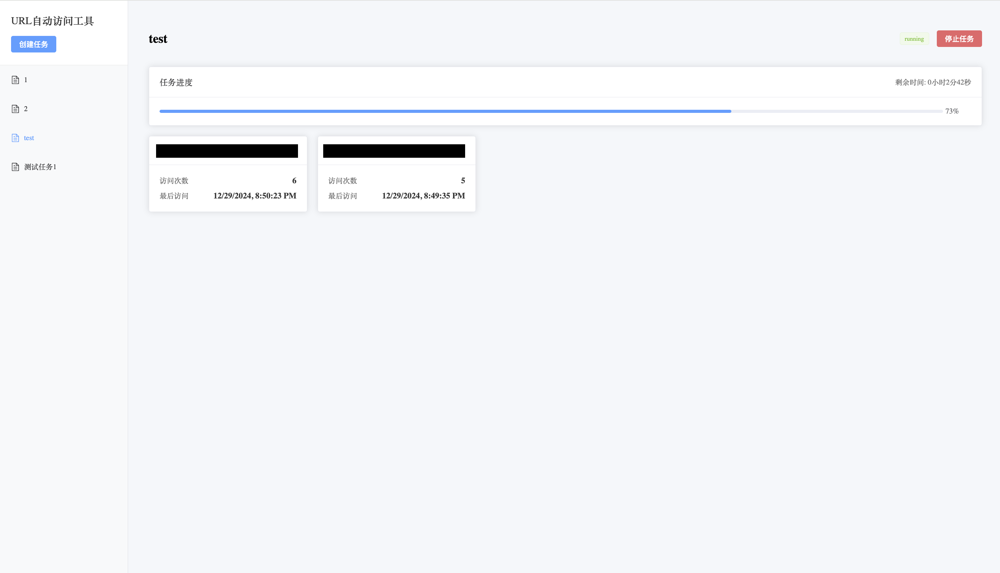

# URL Visitor Tool

一个用于自动访问 URL 的工具，支持批量任务管理和访问统计。


## 功能特点

- 支持批量创建 URL 访问任务
- 可配置访问间隔和超时时间
- 实时任务状态监控
- 访问统计和数据可视化
- 现代化的用户界面

## 技术栈

### 前端
- Vue 3
- Element Plus
- ECharts
- Axios

### 后端
- Go
- Gin Framework

## 快速开始

### 构建说明

在构建 Docker 镜像之前，需要先编译前端和后端代码：

1. 编译前端：
```bash
cd front
npm install
npm run build
```

2. 编译后端（使用交叉编译，生成 Linux 可执行文件）：
```bash
# Mac/Windows 环境下使用以下命令进行交叉编译
GOOS=linux GOARCH=amd64 CGO_ENABLED=0 go build -o flash_visit

# Linux 环境直接编译
go build -o flash_visit
```

3. 构建 Docker 镜像：
```bash
docker build -t url-visitor .
```

4. 运行容器：
```bash
docker run -d -p 3000:3000 url-visitor
```

5. 访问应用：
打开浏览器访问 http://localhost:3000

### 手动部署

#### 前端开发
```bash
cd front
npm install
npm run serve
```

#### 后端开发
```bash
go mod download
go run main.go
```

## 配置说明

### 环境变量
- `PORT`: 应用端口号（默认：3000）
- `API_BASE_URL`: API 基础 URL（默认：http://localhost:8080）

## 使用说明

1. 创建任务
   - 输入任务名称
   - 添加要访问的 URL 列表（每行一个）
   - 设置访问间隔和超时时间
   - 点击创建任务

2. 管理任务
   - 查看任务列表和状态
   - 查看详细的访问统计
   - 停止运行中的任务

## Docker 构建说明

项目使用 nginx 作为反向代理，将前端请求转发到后端服务。整个应用打包在一个容器中运行：

1. 前端文件位于 `/usr/share/nginx/html`
2. 后端二进制文件位于 `/app/flash_visit`
3. nginx 配置位于 `/etc/nginx/conf.d/default.conf`
4. supervisord 用于管理 nginx 和后端服务

### 目录结构
```
.
├── front/              # 前端代码
│   ├── src/           # 源代码
│   └── package.json   # 依赖配置
├── main.go            # 后端入口
├── Dockerfile         # Docker 构建文件
├── nginx.conf         # Nginx 配置
├── supervisord.conf   # Supervisord 配置
└── README.md          # 项目说明
```